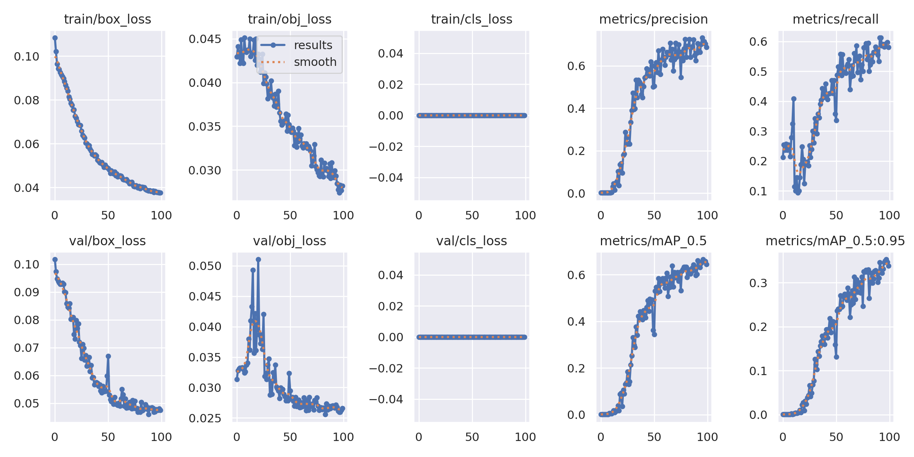

# 🚗 YOLOv5 Pothole Detector: Real-world Detection Pipeline


---

## 📌 프로젝트 요약 (Project Overview)
본 프로젝트는 선행 프로젝트([object-detection-fundamentals](https://github.com/AD-Styles/object-detection-fundamentals))에서 쌓은 IoU, NMS, 멀티태스크 탐지 모델의 원리를 토대로, **실무 수준의 SOTA 모델을 실제 문제에 적용**하는 것을 목표로 합니다. Roboflow의 도로 포트홀 데이터셋으로 YOLOv5를 커스텀 학습하고, 실제 도로 영상에서 포트홀을 실시간으로 탐지하는 전체 파이프라인을 구축하였습니다. 단순히 YOLOv5 명령어를 실행하는 것을 넘어, **YAML 설정부터 학습, 검증, 실제 영상 추론까지 전 과정을 직접 설계하고 실행**한 기록입니다.

---

## 🎯 핵심 목표 (Motivation)
| 핵심 역량 | 상세 목표 및 엔지니어링 포인트 |
| :--- | :--- |
| **실전 데이터 파이프라인<br>(Data Pipeline)** | Roboflow 포트홀 데이터셋 다운로드 → YAML 설정 → Train/Val/Test 분할 자동화 |
| **커스텀 모델 설정<br>(Custom Configuration)** | YOLOv5s YAML을 단일 클래스(nc=1)로 수정하여 포트홀 전용 탐지 모델 구성 |
| **실무 추론 파이프라인<br>(Real-world Inference)** | 학습된 best.pt 가중치로 실제 도로 mp4 영상에서 프레임별 실시간 포트홀 탐지 |

---

## 1. 프로젝트 구조
    ├── results/
    │   └── yolo_results.png     # YOLOv5 학습 결과 그래프 (Loss, mAP 곡선)
    ├── src/
    │   └── train_yolo.py        # YOLOv5 전체 학습 파이프라인 (clone → download → train → val → test)
    ├── .gitignore               # 불필요한 파일 업로드 방지
    ├── LICENSE                  # MIT License (AD-Styles)
    ├── README.md                # 프로젝트 리포트
    └── requirements.txt         # 라이브러리 설치 목록

> **Note**: BBox 연산(IoU, NMS) 및 Single Object Detector 구현 코드는
> 선행 프로젝트 [object-detection-fundamentals](https://github.com/AD-Styles/object-detection-fundamentals)를 참고해주세요:)

---

## 2. 핵심 구현 상세 (Implementation Details)

### 🔹 YOLOv5 커스텀 학습 파이프라인

**데이터셋**: Roboflow Public Pothole Dataset — 665장, Train/Val/Test = 7:2:1, 단일 클래스(pothole)

**학습 설정**:
- Model: YOLOv5s (커스텀 YAML — nc=1로 수정)
- Epochs: 100 / Batch: 32 / Image size: 640
- Weights: scratch (사전학습 없이 처음부터 학습)

**`train_yolo.py` 실행 단계**:
```
--mode clone     → YOLOv5 레포 클론 및 requirements 설치
--mode download  → Roboflow 포트홀 데이터셋 다운로드 + YAML 자동 설정
--mode train     → 커스텀 YOLOv5s 학습 (100 Epochs)
--mode val       → best.pt 기준 검증 (IoU 0.75)
--mode test      → 실제 도로 영상(mp4) 실시간 추론
--mode results   → yolo_results.png 저장
--mode all       → 전체 파이프라인 한 번에 실행
```

**평가 지표**:
| 지표 | 설명 |
| :--- | :--- |
| `box_loss` | 바운딩 박스 위치 오차 |
| `obj_loss` | 객체 존재 여부 오차 |
| `cls_loss` | 클래스 분류 오차 |
| `mAP50` | IoU 50% 기준 평균 정밀도 |
| `mAP50-95` | IoU 50~95% 구간 평균 정밀도 |

---

## 3. 실험 결과 (Results)

### 📈 YOLOv5 Pothole Detection — 학습 결과
| YOLOv5 학습 결과 (results.png) |
| :---: |
|  |

- **엔지니어링 인사이트**: YOLOv5의 3개 손실(box / obj / cls)이 모두 안정적으로 수렴하였으며, mAP50이 빠르게 상승하는 패턴을 확인했습니다. 특히 scratch 학습(사전학습 없음)임에도 665장의 소규모 데이터셋에서 포트홀을 성공적으로 탐지한 것은 YOLO 아키텍처의 강력한 특징 추출 능력을 증명합니다. 실제 도로 영상(mp4)에 대한 프레임별 실시간 추론에서도 포트홀이 일관되게 검출되었습니다.

---

## 💡 회고록 (Retrospective)
이번 프로젝트에서는 선행 프로젝트에서 직접 구현했던 IoU, NMS, 멀티태스크 Loss의 원리를 머릿속에 쌓아둔 상태에서 YOLOv5를 사용했습니다. 그 차이는 명확했습니다.

- **YAML 설정이 다르게 읽혔습니다**: `nc: 1`, `anchors`, `depth_multiple` 등의 설정값이 단순한 숫자가 아니라, 선행 프로젝트에서 직접 구현했던 개념들의 실무적 추상화임을 이해할 수 있었습니다. `anchors`가 선행 프로젝트에서 배운 Anchor Box 개념 그대로임을, `nc`가 Detection Head의 출력 채널 수임을 바로 연결할 수 있었습니다.

- **에러가 발생했을 때 어디를 봐야 하는지 알았습니다**: 학습 중 box_loss가 수렴하지 않는 구간에서, 단순히 하이퍼파라미터를 조정하는 것이 아니라 YAML의 anchor 설정과 데이터셋의 BBox 분포 사이의 불일치를 먼저 의심할 수 있었습니다. 원리를 아는 것이 문제 해결의 출발점이 된다는 것을 실감했습니다.

- **실제 도로 영상에서 포트홀이 검출되는 순간**: 프레임마다 포트홀 위에 바운딩 박스가 그려지는 결과물을 보았을 때, 선행 프로젝트에서 직접 구현했던 NMS가 내부에서 작동하고 있다는 사실이 단순한 지식이 아닌 실감으로 다가왔습니다. 원리에서 출발해 실전 서비스 수준의 결과물까지 도달하는 과정이 하나의 완결된 여정으로 느껴졌습니다.

이 프로젝트를 통해 **"라이브러리를 쓸 줄 아는 것"과 "라이브러리 내부를 이해하고 쓰는 것"** 의 차이가 실무에서 어떻게 드러나는지를 직접 경험했습니다.
